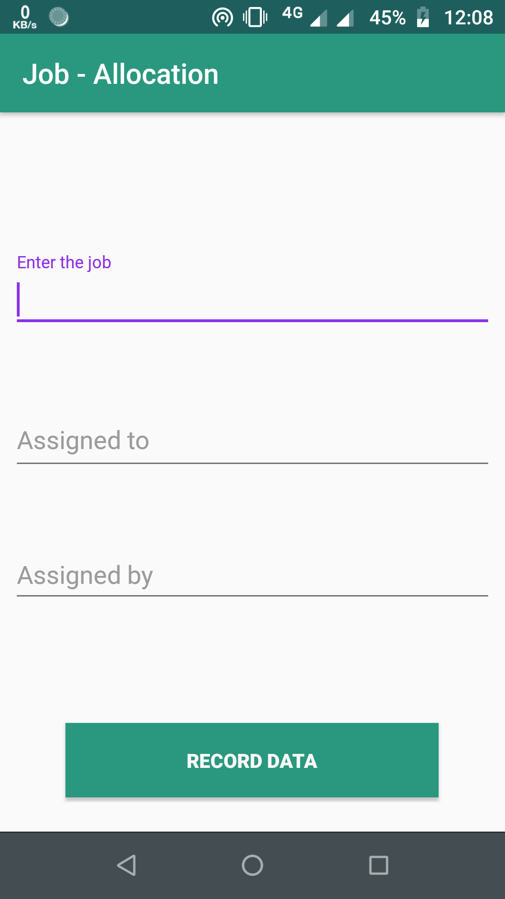
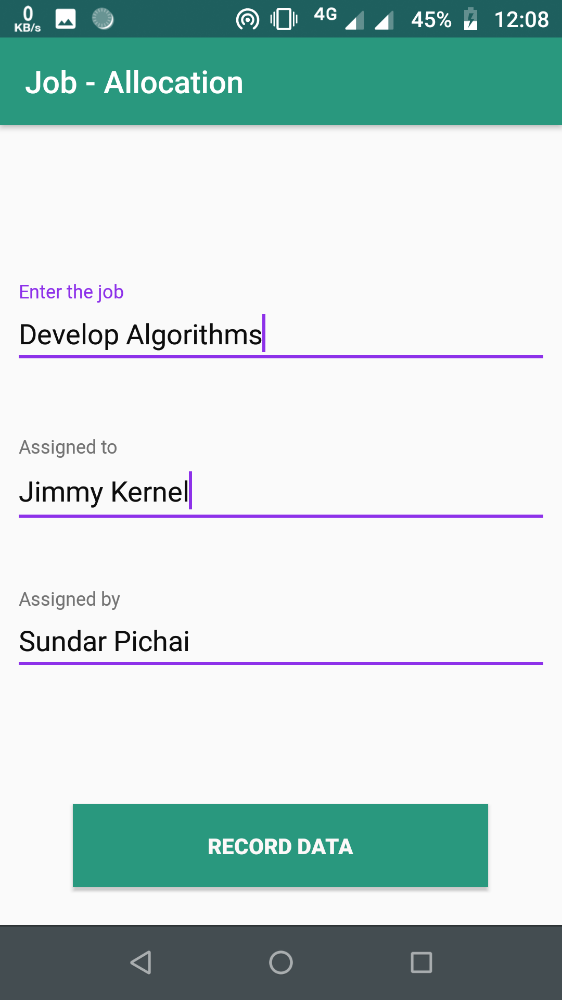
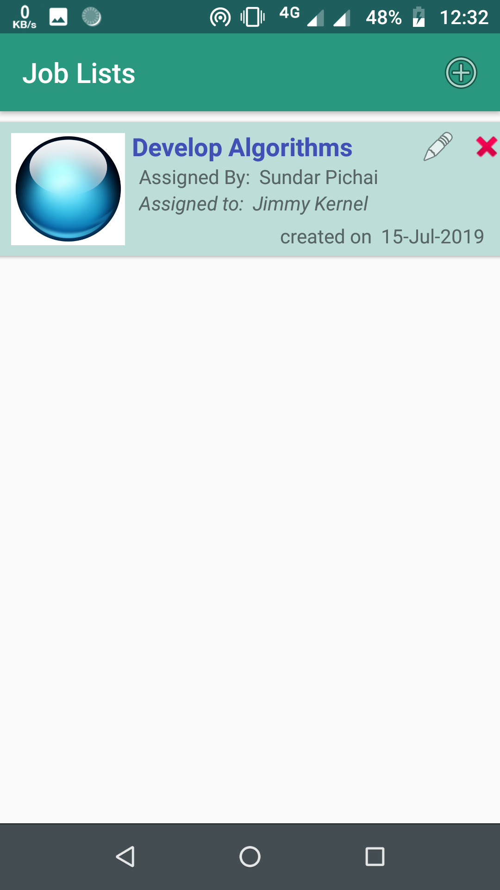
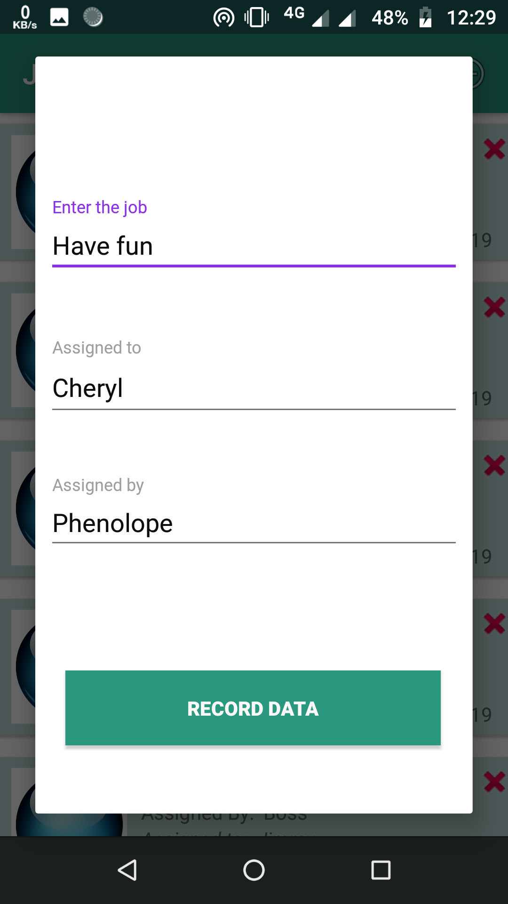
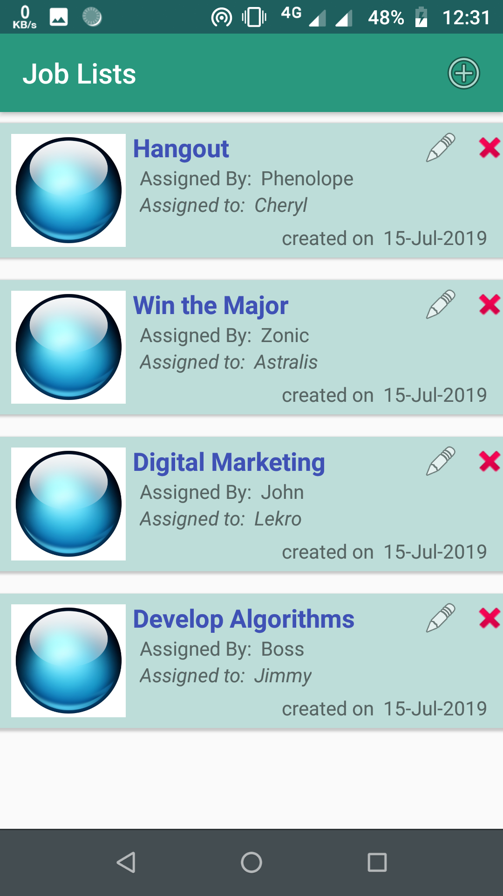

#  Job Allocation

## Overview

Do you remember or forget sometimes to whom you allocated a task ??
Have a look at Job Allocation app build with SQLite database and Kotlin support 

It is an Job recording application with an offline database to store the jobs allocated to a person by any authority.The app can be used in coordinating the task distribution for a project and many more creative ways. A custom ListView holds the info: `Job`, `assigned to`, `assigned by`, `date of creation`.Any item in the ListView can be `edited`, `updated` and also `deleted` as well, any time by a `ClickListener` on the items of the ListView.

You dont need to remember the allocation......the Job Allocation app would do this for you ..!!

## Features

* SQLite Database
* Splash screen
* Animation styles
* Custom ListView
* ImageView
* progress dialog
* Minimal Design
* Simplified Theme
* Well Constrained Layout

## Platform
        -> Android Studio
        -> With Kotlin Support

## Accessing tips :

1. Clone or download the repository: `https://github.com/P4NK4J/Android_Kotlin_Job-Allocation_app`
2. Navigate to the folder `app` Folder
3. Navigate to the folder `Android_Kotlin_Job-Allocation_app/app/src/` to access developers content
3. Navigate to the folder `Apk` for users to access apk
4. Copy the apk from folder `Apk` to an android phone
5. Install the apk

The app is finally installed on your Android mobile device !!

To directly download the apk [Click Here](https://github.com/P4NK4J/Android_Kotlin_Job-Allocation_app/blob/master/APK/jobAllocation.apk)

 # Screenshots:

 
 

 
 

## Resources, Activities and Manifest for the Application

For curious Kotlin programmers [Click here](https://github.com/P4NK4J/Android_Kotlin_Job-Allocation_app/tree/master/app/src/main/java/com/example/android_kotlin_job_allocation_app)

Packages for backend Files:

* [activity](https://github.com/P4NK4J/Android_Kotlin_Job-Allocation_app/tree/master/app/src/main/java/com/example/android_kotlin_job_allocation_app/activity)
* [data](https://github.com/P4NK4J/Android_Kotlin_Job-Allocation_app/tree/master/app/src/main/java/com/example/android_kotlin_job_allocation_app/data)
* [model](https://github.com/P4NK4J/Android_Kotlin_Job-Allocation_app/tree/master/app/src/main/java/com/example/android_kotlin_job_allocation_app/model)

Frontend resource files are stored in `res` package

* [res](https://github.com/P4NK4J/Android_Kotlin_Job-Allocation_app/tree/master/app/src/main/res)

Android manifest file for the project:

* [AndroidManifest.xml](https://github.com/P4NK4J/Android_Kotlin_Job-Allocation_app/blob/master/app/src/main/AndroidManifest.xml)
